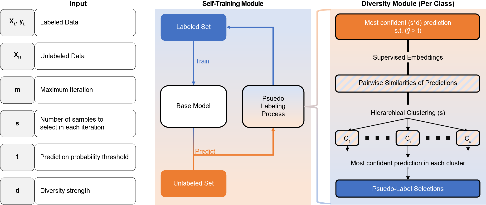

<h1>
  <br>
  <a href="https://github.com/joanagoncalveslab/DCAST/archive/refs/heads/main.zip">DCAST</a>
</h1> 

<h4 align="center">Diverse Class-Aware Self-Training</h4>

<p>
    <a href="https://gitlab.ewi.tudelft.nl/goncalveslab/phd-thesis-2020-yasin-tepeli/DCAST/-/commits/main">
    
    <a href="https://gitlab.ewi.tudelft.nl/goncalveslab/phd-thesis-2020-yasin-tepeli/DCAST/-/issues">
    
    <a href="https://gitlab.ewi.tudelft.nl/goncalveslab/phd-thesis-2020-yasin-tepeli/DCAST/-/branches">
    
    <a href="https://twitter.com/intent/tweet?text=Try biasing and debiasing your ML models with hierarhcy bias and DCAST from @GoncalvesLab &url=https://gitlab.ewi.tudelft.nl/goncalveslab/phd-thesis-2020-yasin-tepeli/DCAST">
    
    
</p>
      
<p>
  <a href="#abstract">Abstract</a> •
  <a href="#repository-description">Repository Description</a> •
  <a href="#Bias-induction-framework">Bias Induction via Hierarchy Bias</a> •
  <a href="#framework-and-single-cancer-experiment">Bias Mitigation via DCAST</a> •
  <a href="#installation-and-dependencies">Installation and Dependencies</a> •
  <a href="#dataset-generation">Dataset Generation</a> •
  <a href="#direct-usage-of-dcast">Direct Usage of DCAST</a> •
  <a href="#code-integration">Code Integration</a> •
  <a href="#bibtext-reference">Bibtext Reference</a> •
  <a href="#license">License</a>
</p>


---

## Abstract

<table>
<tr>
<td>
  
Fairness in machine learning seeks to mitigate bias against individuals based on sensitive features such as gender or income, wherein selection bias is a common cause of suboptimal models for underrepresented profiles. Notably, bias unrelated to sensitive features often goes undiagnosed, while it is prominent in complex high-dimensional settings from fields like computer vision and molecular biomedicine. Strategies to mitigate unidentified bias and induce bias for evaluation of mitigation methods are crucially needed, yet remain underexplored. We introduce: (i) Diverse Class-Aware Self-Training (DCAST), model-agnostic mitigation aware of class-specific bias, which promotes sample diversity to counter confirmation bias of conventional self-training while leveraging unlabeled samples for an improved representation of the real-world distribution; (ii) hierarchy bias, for multivariate and class-aware bias induction without prior knowledge. Models learned with DCAST showed improved robustness to hierarchy and other biases across eleven real-world datasets, against conventional self-training and six prominent domain adaptation techniques. Advantage was largest for higher-dimensional datasets, suggesting DCAST as a promising strategy to achieve fairer learning.

(Published in ...  <a href="#">DCAST: Diverse Class-Aware Self-Training Mitigates Selection Bias for Fairer Learning</a>)

</td>
</tr>
</table>


## Bias Induction Framework

**Hierarchy bias approach for induction of selection bias.**
Given input data $\boldsymbol{X}$ with labels $\boldsymbol{y}$, number of samples to select $k$, and bias ratio $b \in [0,1]$, hierarchy bias selects $k$ samples per class $c$: $k \times b$ from a specific group and $k \times (1-b)$ from the remaining samples. Each class-specific candidate group (for class $c$) is identified via agglomerative hierarchical clustering with Euclidean distances and Ward linkage of the $c$-labeled samples until a cluster of size $\geq k$ is obtained, from which $k \times b$ samples are uniformly drawn. The $k \times (1-b)$ samples are uniformly drawn from the remaining $c$-labeled samples. 

## Bias Mitigation Framework

**Diverse Class-Aware Self-Training (DCAST) framework.**
(Left) Input to DCAST. 
Labeled data $\boldsymbol{X}_L$ (with labels $\boldsymbol{y}_L$) and unlabeled data $\boldsymbol{X}_U$, maximum number of iterations $m$, number of pseudo-labeled samples $s$ to select per iteration, confidence or prediction probability threshold $t \in [0,1]$, and integer diversity strength parameter $d \geq 1$. 
(Middle) Self-training module. At each iteration, a model trained with labeled samples is used to predict pseudo-labels for unlabeled samples, from which a subset is newly selected and added to the labeled set for the next iteration. 
(Right) Diversity module. 
Selects the subset of $s_c = s \times class\_ratio(c)$ confidently predicted and diverse pseudo-labeled samples per class $c$, as follows: (i) select the top $s_c \times d$ samples from the unlabeled set with confidence or prediction probability larger than $t$ (or $1.2/C$, whichever is largest); and (ii) reduce this $s_c \times d$ selection to a set of $s_c$ diverse samples by identifying $s_c$ clusters using hierarchical clustering (agglomerative single-linkage) and selecting the most confidently predicted sample from each cluster. Note that $class\_ratio$ can otherwise be fixed to be equal across classes. Distance between samples is based on either learned discriminative embeddings, relating samples with respect to prediction output, or alternatively an unsupervised embedding or the original feature space. When $d=1$, DCAST becomes CAST, without the diversity strategy.


## Repository Description

##### Folder hierarchy:
* **data**: Includes all the data for feature generation or experiments.
  * **datasets**: Includes different types of tabular datasets.
  * **graphs**: Data folder for graphs.
* **logs**: Log files for each of the experiment and feature generation.
* **results**: json model files and csv experiment performance result files.
* **src**: Includes all the codes for the application.
  * **analysis**: Includes the codes for visualization and reporting the results.
  * **datasets**: Includes codes to process graph data.
  * **test**: Includes the files for the main experiments.
  * **lib**: Includes some utility codes and common visual functions for project.
  * **models**: Includes DCAST model for logistic regression (LR), neural network (NN), and regularized random forest (RRF). For NN and RRF, it also includes Feature-space level diversity for models (FSD).
  * **bias_techniques.py**: File to call functions of different bias induction methods.
  * * **config.py**: File that loads the settings of the project.
  * * **load_dataset.py**: File to load datasets.


## Installation and Dependencies

##### Dependencies
* Python3.9
* Packages: conda_requirements.txt

##### Installation
* Open terminal and go to the folder to install the project
* Clone the project: `git clone https://github.com/joanagoncalveslab/DCAST.git`
* Enter project and install requirements: `cd DCAST | conda create --name DCAST --file conda_requirements.txt`

## Preparation of Data

### Loading a Dataset 
```
from src import load_dataset as ld
dataset_name='breast_cancer'
dataset_args = {}
x_train, y_train, x_test, y_test = ld.load_dataset(dataset_name, **dataset_args, test=True)
```

### Biasing a set
* Induce hierarchy bias with 0.9 strength by choosing 30 samples from each class. 
```
from src import bias_techniques as bt
bias_params = {'max_size': 30, 'prob': 0.9}
selections = bt.get_bias('hierarchy', X, y, **bias_params).astype(int)
X_biased, y_biased = X[selections, :], y[selections]
```
* Induce custom bias with bias arguments.
```
from src import bias_techniques as bt
selections = bt.get_bias(bias_name, X, **bias_params).astype(int)
X_biased, y_biased = X[selections, :], y[selections]
```

## Reproducing Results
### Neural network experiment
```shell script
python3.6 src/test/nn_bias_test_nb_imb2seed.py --bias hierarchy_0.9 --dataset breast_cancer --bias_size 30 -es
```
You can see the saved model and results in `results_nn_test_nb_imb_ss/bias_name/dataset_name` folder.


## Reproducing Results
### Usage of DCAST model


## Code Integration


# Bibtex-Reference
```
@article{tepeli2024DCAST,
  title={DCAST: Diverse Class-Aware Self-Training Mitigates Selection Bias for Fairer Learning},
  author={Tepeli, Yasin I. and Goncalves, Joana P.},
  journal={XXX},
  volume={00},
  number={0},
  pages={000},
  year={2021},
  publisher={Springer Science and Business Media {LLC}}
}
```

## License

[](https://tldrlegal.com/license/gnu-lesser-general-public-license-v3-(lgpl-3))

- Copyright © [ytepeli].

