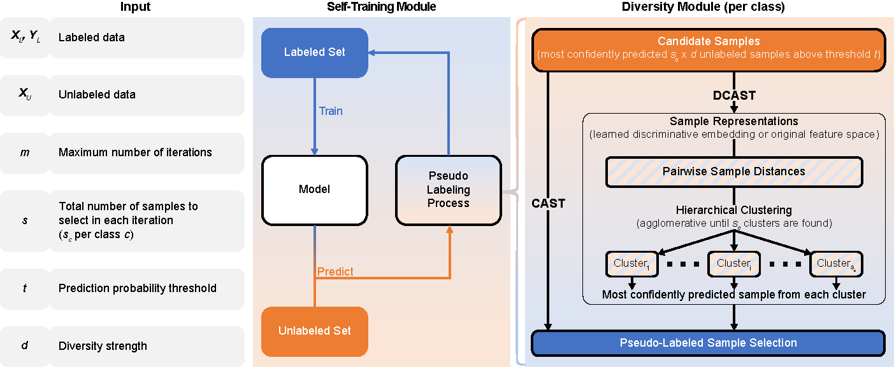

<h1>
  <br>
  <a href="https://gitlab.ewi.tudelft.nl/goncalveslab/phd-thesis-2020-yasin-tepeli/dbast/-/archive/main/dbast-main.zip">ELISL</a>
</h1> 

<h4 align="center">Diversity-guided Balanced Self-Training</h4>

<p>
    <a href="https://gitlab.ewi.tudelft.nl/goncalveslab/phd-thesis-2020-yasin-tepeli/dbast/-/commits/main">
    
    <a href="https://gitlab.ewi.tudelft.nl/goncalveslab/phd-thesis-2020-yasin-tepeli/dbast/-/issues">
    
    <a href="https://gitlab.ewi.tudelft.nl/goncalveslab/phd-thesis-2020-yasin-tepeli/dbast/-/branches">
    
    <a href="https://twitter.com/intent/tweet?text=Try debiasing your ML models with DBaST from @GoncalvesLab &url=https://gitlab.ewi.tudelft.nl/goncalveslab/phd-thesis-2020-yasin-tepeli/dbast">
    
    
</p>
      
<p>
  <a href="#abstract">Abstract</a> •
  <a href="#repository-description">Repository Description</a> •
  <a href="#framework-and-single-cancer-experiment">Framework and Single Cancer Experiment</a> •
  <a href="#installation-and-dependencies">Installation and Dependencies</a> •
  <a href="#dataset-generation">Dataset Generation</a> •
  <a href="#direct-usage-of-elisl">Direct Usage of ELISL</a> •
  <a href="#code-integration">Code Integration</a> •
  <a href="#bibtext-reference">Bibtext Reference</a> •
  <a href="#license">License</a>
</p>


---

## Abstract

<table>
<tr>
<td>
  
Sample selection bias (SSB) is a prevalent issue in machine learning when training data deviates from the ideal independent and identically distributed (i.i.d.) assumption which leads to unfair models and subpar performance. Existing SSB mitigation methods, designed primarily for domain adaptation, are ineffective for unseen test sets, rely on often violated assumptions, and are not model-agnostic. Moreover, common semi-supervised learning techniques, such as Self-training, which includes extra unlabeled data in training, hold promise but often fail to effectively address SSB and may even strengthen it.

We propose Diversity-guided Balanced Self-Training (DBaST), which iteratively incorporates diverse and unbiased unlabeled samples into the training process while preserving class balance to prevent further bias. Extensive testing across 11 real-world datasets demonstrated DBaST's consistent efficacy in mitigating different types of SSB without performance degradation, unlike the previous techniques. Thus, DBaST holds significant promise in effectively addressing SSB challenges and promoting fair learning.

(Published in ...  <a href="#">DBaST: Mitigating Sample Selection Bias for Fair Learning</a>)

</td>
</tr>
</table>


## Framework and Single Cancer Experiment

*Diversity-guided Balanced Self-training (DBaST) framework.*
**Left**: Input of the DBaST framework. DBaST takes labeled data, unlabeled data, number of maximum iterations $m$, number of selections in each iteration $s$, prediction probability threshold $t$, and diversity strength $d$ as input. **Middle:** Self-training module. In each iteration, a model trained with labeled samples is used to predict pseudo-labels of unlabeled samples, and selected samples are added to the labeled set with their pseudo-labels. The pseudo-labeling procedure is repeated for each class separately, ensuring that the class balance of pseudo-labeled samples is the same as labeled samples. **Right:** The diversity module. Separates the pseudo-labeling process for each class and ensures that at each iteration, the unlabeled samples that are pseudo-labeled and added to the labeled set are confidently predicted, diverse, and different from each other. For each class, it first selects the most confident $s*d$ predictions whose prediction probability is over a threshold $t$ and creates supervised embeddings for them, which then can be used to measure the similarity between the prediction of each unlabeled sample. Then using the similarities, \textit{DBaST} creates \textit{s} clusters that are different from each other and selects the most confident prediction from each cluster. Then pseudo-labels the $s$ selected samples. This way, it still selects confident samples but ensures that we don't select the same type of predictions repeatedly. Note that when $d=1$, DBaST loses the diversity approach and becomes BaST.


## Repository Description

##### Folder hierarchy:
* **data**: Includes all the data for feature generation or experiments.
  * **datasets**: Includes different types of tabular datasets.
  * **graphs**: Data folder for graphs.
* **logs**: Log files for each of the experiment and feature generation.
* **results**: json model files and csv experiment performance result files.
* **src**: Includes all the codes for the application.
  * **analysis**: Includes the codes for visualization and reporting the results.
  * **datasets**: Includes codes to process graph data.
  * **test**: Includes the files for the main experiments.
  * **lib**: Includes some utility codes and common visual functions for project.
  * **models**: Includes DBaST model for logistic regression (LR), neural network (NN), and regularized random forest (RRF). For NN and RRF, it also includes Feature-space level diversity for models (FSD).
  * **bias_techniques.py**: File to call functions of different bias induction methods.
  * * **config.py**: File that loads the settings of the project.
  * * **load_dataset.py**: File to load datasets.


## Installation and Dependencies

##### Dependencies
* Python3.9
* Packages: conda_requirements.txt

##### Installation
* Open terminal and go to the folder to install the project
* Clone the project: `git clone https://gitlab.tudelft.nl/ytepeli/ELISL.git`
* Enter project and install requirements: `cd ELISL | conda create --name DBAST --file conda_requirements.txt`

## Preparation of Data

### Loading a Dataset 
```
from src import load_dataset as ld
dataset_name='breast_cancer'
dataset_args = {}
x_train, y_train, x_test, y_test = ld.load_dataset(dataset_name, **dataset_args, test=True)
```

### Biasing a set
* Induce hierarchy bias with 0.9 strength by choosing 30 samples from each class. 
```
from src import bias_techniques as bt
bias_params = {'max_size': 30, 'prob': 0.9}
selections = bt.get_bias('hierarchy', X, y, **bias_params).astype(int)
X_biased, y_biased = X[selections, :], y[selections]
```
* Induce custom bias with bias arguments.
```
from src import bias_techniques as bt
selections = bt.get_bias(bias_name, X, **bias_params).astype(int)
X_biased, y_biased = X[selections, :], y[selections]
```

## Reproducing Results
### Neural network experiment
```shell script
python3.6 src/test/nn_bias_test_nb_imb2seed.py --bias hierarchy_0.9 --dataset breast_cancer --bias_size 30 -es
```
You can see the saved model and results in `results_nn_test_nb_imb_ss/bias_name/dataset_name` folder.


## Reproducing Results
### Usage of DBaST model


## Code Integration


# Bibtex-Reference
```
@article{tepeli2021elisl,
  title={Early-Late Integrated Synthetic Lethality Prediction in Cancer},
  author={Tepeli, Yasin and Seale, Colm and Goncalves, Joana},
  journal={Nature Machine Intelligence},
  volume={00},
  number={0},
  pages={000},
  year={2021},
  publisher={Springer Science and Business Media {LLC}}
}
```

## License

[](https://tldrlegal.com/license/gnu-lesser-general-public-license-v3-(lgpl-3))

- Copyright © [ytepeli].

